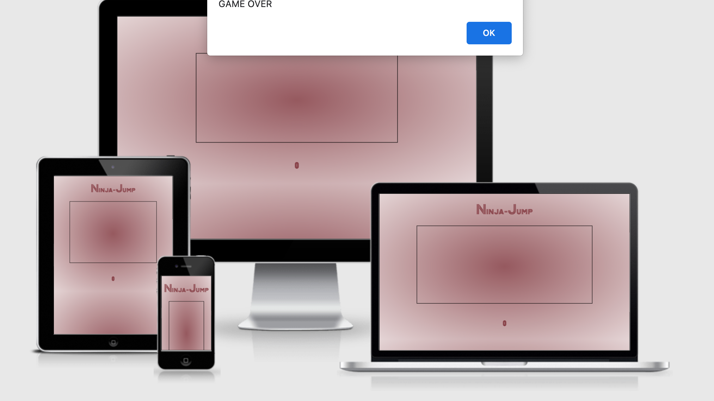
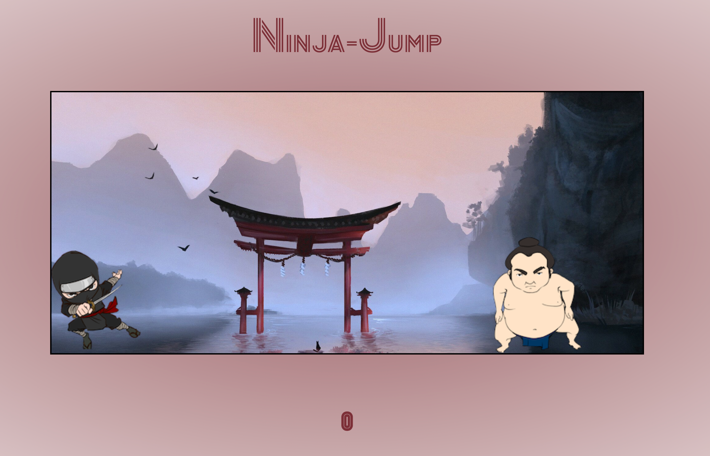
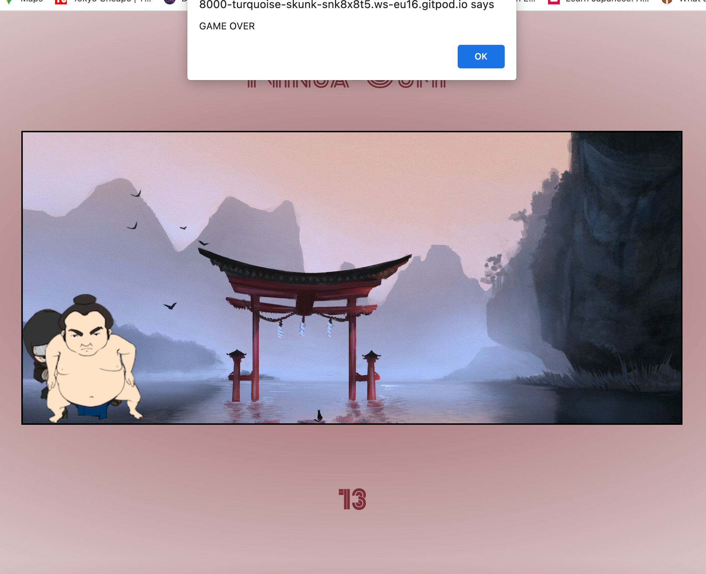
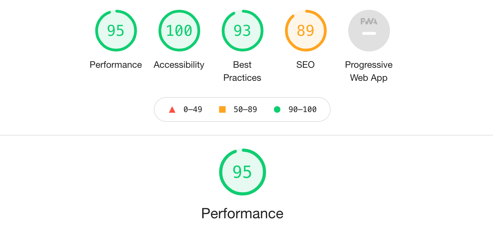
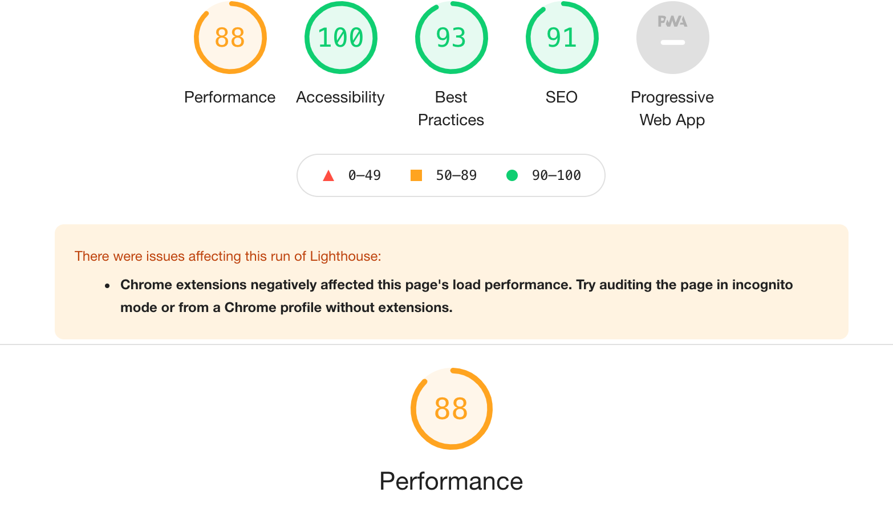

# Ninja Jump Game 
------------------------------------------------
## The Ninja Jump game is for anyone to play to pass the time. It's a very simple game where the user has to keep jumping over the Sumo Wrestler to try and get the highest score possible. If the Sumo Wrestler hits the Ninja the game is over and the user has the option to start the game again to try and beat their score.
------------------

----------------------------
 
# Features

## The Game screen has the title of the game, the game area and the score at the bottom. The game area shows a Japanese cartoon background with a Ninja and a Sumo Wrestler. The Ninja can be operated by using any key on the type pad to make him jump. The Sumo Wrestler keeps trying to hit the Ninja continually. If the Sumo Wrestler hits the Ninja the game is over and the score stops. An alert box will pop up to inform the user that the game is over and enable them to try the game again.

---------------------------------------

----------------------------------------

-------------------------------------------
# Testing

## I ran the code through [W3C Validator](https://validator.w3.org/) and no issues were found.

## CSS code ran through [W3C CSS Validator](https://validator.w3.org) and no issues were found.

## I ran the code through [JSHint](https://jshint.com/) and no issues were found.

## Lighthouse in Chrome developer tools was used to test the page. This was done for mobile and desktop. Below are the results.

------------------------------------------

## Deployment

This Website was depolyed on Github pages.

1. Select the setting tab in the Github repository page.

2. Scroll down and click on the new dedicated tag line for Github pages.

3. From the source drop down menu select the master branch and click save.

4. The page will automatically refresh and indicate whether there has been a successful deployment.

The live link to the webpage can be found here - 