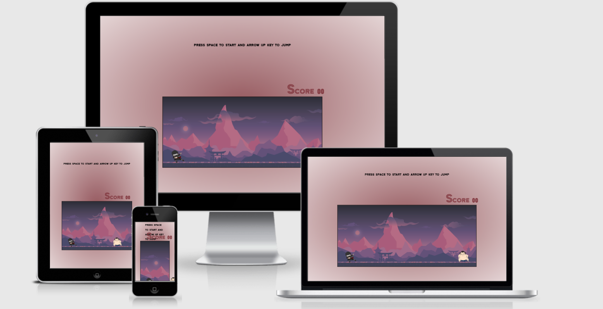

# Ninja Jump Game 

The Ninja Jump game is for anyone to play to pass the time. It's a very simple game where the user has to keep jumping over the Sumo Wrestler to try and get the highest score possible. If the Sumo Wrestler hits the Ninja the game is over and the user has the option to start the game again to try and beat their score.

[Here is the live version link to my project](https://j-r77-stack.github.io/ninja-jump-game/)

## Menu

* [About](#About)

* [UX](#ux)

  * Design
  * Wireframes

* [Features](#features)

* [Tecnologies Used](#tecnologies_used)

* [Testing](#testing)

* [Deployment](#deployment)

* [Credits](#credits)
 
# About

The Game does not have navigation and is very simple, it's just a one page website. The page has the game area, with the simple game instructions at the top and the score to the side. The game area shows a Japanese cartoon background with a Ninja and a Sumo Wrestler. The game is started by pressing the space bar key as indicated in the instructions. Once this is done the score will start to go up and the Wrestler will move towards the Ninja. The Ninja can be operated by pressing the arrow up key to make him jump. The longer the ninja can keep jumping over the sumo wrestler the higher the score will be. The Sumo Wrestler keeps trying to hit the Ninja continually. If the Sumo Wrestler hits the Ninja the game is over and the score stops. Game Over appears on the screen and the player can take a note of their score before pressing the space key to try again.

# UX

## Design
The site is designed with one page - The game screen. There are no navigation links.
  
## Wireframes
  Below is the wireframe that I created using [Balsamiq](https://balsamiq.com/)

  ### Game Screen
  

# Features
The game is responsive and is designed to be played on desktop, laptop and ipad. It does not work on mobile as of yet. It features:
* Game Instructions

* Game Score

* Game Screen

* Game Over screen

## Future Features
* Improve responsiveness, so can be used on different screen sizes.
* Improve the sensitivity of the two characters to make the game crisper.
* Add difficulty levels and score stats.

# Tecnologies Used
    
  ### Languages

  1. [HTML5](https://en.wikipedia.org/wiki/HTML5)
  2. [CSS](https://en.wikipedia.org/wiki/CSS)
  3. [Javascript](https://en.wikipedia.org/wiki/JavaScript)

  ### Tools and Fonts

  1. [Google Fonts](https://fonts.google.com/)
      * Main font being Zen Tokyo Zoo

  2. [Git](https://git-scm.com/)
      * Used for version control.

  3. [GitHub](https://github.com/)
      * Used to store the code once pushed from Git.

  4. [Balsamiq](https://balsamiq.com/)
      * A wireframe program used to create the mock-ups.

# Testing

I ran the code through [W3C Validator](https://validator.w3.org/) and no issues were found.

CSS code ran through [W3C CSS Validator](https://validator.w3.org) and no issues were found.

I ran the code through [JSHint](https://jshint.com/) and no issues were found.

Lighthouse in Chrome developer tools was used to test the page. This was done for desktops. The game does not work on a moble as of yet. Below is the result.

# Deployment

This Website was depolyed on Github pages.

1. Select the setting tab in the Github repository page.

2. Scroll down and click on the new dedicated tag line for Github pages.

3. From the source drop down menu select the main branch and click save.

4. The page will automatically refresh and indicate whether there has been a successful deployment.

# Credits

## Media
* The images for the project were taken from [clipartmax](https://www.clipartmax.com/)

* The font is from [google fonts](https://fonts.google.com/)

## Background Image and colors

* The background image was taken from [mocah](https://mocah.org/)

* The background color was built from [rgbacolorpicker] (https://rgbacolorpicker.com/hex-color-picker)

## Acknowledgements
This was my first time using Javascript to try and build something. I found it pretty challenging but also enjoyable.  I'd like to thank:

* [Code Institute](https://codeinstitute.net/) - For great walk through projects and lessons.
* [w3schools](https://www.w3schools.com/) - A great webpage for someone beginning their journey with code.
* [stackoverflow](https://stackoverflow.com/) - Another very useful site.

